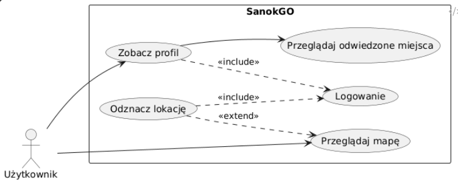

# SanokGO
PL:
Aplikacja SanokGO to mała turystyczna aplikacja zawierająca mapę z interesującymi miejscami w Sanoku, automatycznie odznaczająca miejsca, które zalogowany użytkownik już odwiedził. Aplikacja została napisana w HTML, CSS, JS bez użycia żadnych frameworków. 

W celu użycia aplikacji, należy wejść na stronę: https://keszotrab.github.io/SanokGO/index.html.
Po wejściu na stronę, użytkownik zobaczy mapę, oraz jego lokacje (wymaga dostępu do lokalizacji na urządzeniu). Od tego momentu, lokacje w które użytkownik odwiedził, zostaną oznaczone, jednakże, w celu zapisania swoich postępów, użytkownik musi zarejestrować się i zalogować na stronie. Wszystkie odwiedzone lokacje zostaną zapisane w profilu użytkownika. 

 

ENG: 
A little tourist app, letting the user track what they have yet to visit in a city of Sanok.